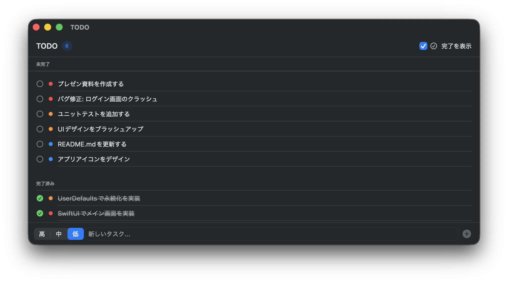

# TODO

macOS 向けのシンプルなネイティブ TODO アプリです。



## 機能

- タスクの追加・削除・完了管理
- 優先度（高 / 中 / 低）のカラーコード表示
- 未完了 / 完了済みのセクション分け
- 完了済みタスクの表示 / 非表示切り替え
- 行ホバーで削除ボタン表示、右クリックコンテキストメニュー
- UserDefaults への自動永続化（アプリ再起動後もデータを保持）

## 動作環境

- macOS 13.0 (Ventura) 以降
- Xcode 15 以降

## ビルド方法

```bash
git clone https://github.com/Tierra-Soft/todo.git
cd todo
open todo.xcodeproj
```

Xcode で `⌘R` を押すとビルド・起動できます。

## 構成

```
todo/
├── TodoApp.swift       # @main エントリポイント
├── TodoItem.swift      # データモデル（Codable）
├── TodoStore.swift     # 状態管理（@MainActor ObservableObject）
└── ContentView.swift   # メイン UI・TodoRow
```

## 技術スタック

- **SwiftUI** — 宣言的 UI フレームワーク
- **UserDefaults** — JSON シリアライズによるローカル永続化
- `@MainActor` / `ObservableObject` — スレッドセーフな状態管理
